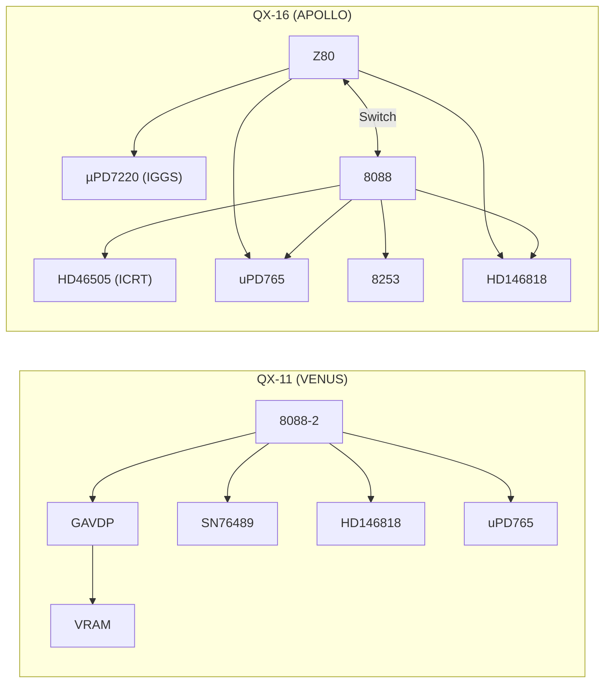
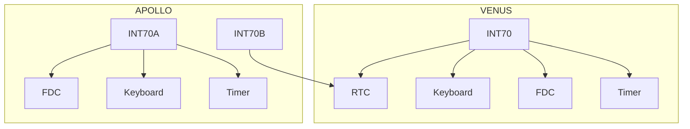

# Epson QX-11 (VENUS) vs QX-16 (APOLLO)
### Complete Hardware, Firmware, and Architecture Reference

---

## Overview

The Epson QX-11 and QX-16 represent two fundamentally different internal platforms:

- **VENUS (QX-11)** → Integrated, ROM-based MS-DOS system
- **APOLLO (QX-16)** → Dual-CPU, disk-booted CP/M + MS-DOS system

These systems share key subsystems but diverge heavily in architecture, video, sound, and system design philosophy.

---

## Internal Codenames

| Codename | System |
|----------|--------|
| VENUS | QX-11 |
| APOLLO | QX-16 |

### Firmware Evidence
- "FOR QX-88 and APOLLO COMPUTERS"
- "makes us incompatible with VENUS"

👉 Confirms two independent platforms.

---

## CPU Architecture

### QX-11 (VENUS)
- Intel **8088-2**
- Single CPU
- ROM-based MS-DOS execution

### QX-16 (APOLLO)
- **Z80 + 8088**
- Z80:
  - IPL
  - CP/M
- 8088:
  - MS-DOS
- Hardware CPU switching (port 24h)

---

## Boot Architecture

### QX-11
- MS-DOS 2.11 in ROM
- Instant-on system
- Optional ROM cartridge execution

### QX-16
- IPL starts on Z80
- Detects disk type via READ ID
- Switches CPU depending on OS

---

## Full System Architecture Diagram

---

## Video Systems

### QX-11
- **GAVDP (integrated)**
- Memory-mapped VRAM
- Modes: 640x400, 320x200
- Optional VNS-ICRT:
  - HD46505
  - GAIBVA / GAIBVD

### QX-16
- Z80 → **APX-IGGS (µPD7220)**
- 8088 → **APX-ICRT**
  - HD46505
  - GAIBVA / GAIBVD

👉 Two independent pipelines

---

## Floppy Subsystem (Identical Core)

- **uPD765**
- **GAFDDC**
- **SED9421COB**

### Signal Path

Drive → SED9421COB → GAFDDC → uPD765 → CPU

---

## Real-Time Clock

| System | Ports |
|--------|------|
| QX-11 | 10h / 11h |
| QX-16 | 3Ch / 3Dh |

Same chip: **HD146818**

---

## Sound System

### QX-11
- SN76489 (port 14h)
- Multi-channel PSG

### QX-16
- 8253 timers
- Speaker only

---

## I/O Mapping Overview

### QX-11

| Port | Function |
|------|---------|
| 04h/05h | Interrupt mask |
| 0Ch/0Dh | Gate array |
| 0Eh/0Fh | Drive/Joystick |
| 10h/11h | RTC |
| 12h/13h | FDC |
| 14h | PSG |

### QX-16

| Port | Function |
|------|---------|
| 08h | EOI |
| 18h | Speaker |
| 24h | CPU control |
| 30h | Floppy status |
| 34h/35h | FDC |
| 3Ch/3Dh | RTC |

---

## Interrupt Architecture

---

## Interrupt Table

| Function | QX-11 | QX-16 |
|----------|------|-------|
| Base | INT 70h | INT 70h |
| Timer | INT 71h | INT 71h |
| Keyboard | INT 75h | INT 74h |
| FDC | INT 74h | INT 76h |
| RTC | INT 7Ah | INT 7Ah |

---

## Critical Engineering Insights

### 1. Same Philosophy, Different Mapping
- INT 70h base shared
- Device vectors differ

### 2. Floppy System = Anchor Point
- Identical architecture
- Useful for emulation and hardware mods

### 3. Video = Biggest Divergence
- QX-11 → unified
- QX-16 → split

### 4. Sound = Simplification vs Capability
- QX-11 → PSG
- QX-16 → speaker

### 5. VENUS vs APOLLO = Platform Split
- Not compatible at low level

---

## Final Conclusion

The QX-11 and QX-16 are not variations of the same machine.

They are two separate Epson platforms:

- **VENUS → Integrated DOS workstation**
- **APOLLO → Hybrid multi-CPU system**

Understanding this distinction is essential for:
- Emulation (MAME)
- BIOS reverse engineering
- Hardware interfacing
