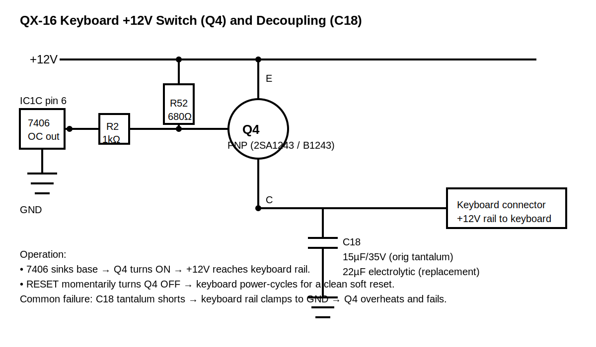
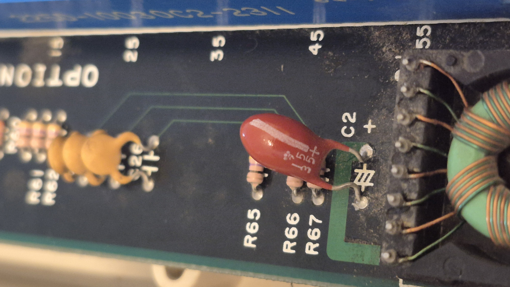

# Epson QX-16 Keyboard Power Failure  
## Q4 High-Side Switch & C18 Shorted Tantalum Repair

---

## 📷 Original Circuit Diagram (Vector)

---

## 📷 C18 Capacitor (Failed Component)

*Figure — Original 15µF / 35V tantalum capacitor (shorted internally).*

---

## Overview

The Epson QX-16 keyboard receives +12V through a high-side PNP transistor (Q4).  
This transistor allows the system to power-cycle the keyboard during a soft reset.

When the RESET button is pressed:

- The CPU performs a soft reset
- Q4 removes +12V from the keyboard rail
- The keyboard controller fully reboots
- Power is restored

If this circuit fails, the keyboard will not receive power or will not reset correctly.

---

## Circuit Description

Relevant components:

- **Q4** – PNP transistor (2SA1243 / B1243)
- **C18** – 15µF / 35V tantalum (replaced with 22µF electrolytic)
- **7406 (IC1C)** – Open-collector inverter driving Q4 base
- **R52 (680Ω)** – Base pull-up to +12V
- **R2 (1kΩ)** – Series resistor between 7406 output and Q4 base
- Keyboard +12 rail fed from Q4 collector

### Functional Summary

- Emitter → +12V  
- Collector → Keyboard +12 rail  
- Base → Controlled by 7406  
- C18 → Decoupling capacitor on keyboard +12 rail  

When 7406 output goes LOW:
- Base pulled down
- Q4 turns ON
- Keyboard receives +12V

When RESET is pressed:
- 7406 logic removes drive
- Q4 turns OFF
- Keyboard power drops
- Keyboard power cycles

---

## Symptoms Observed

- No +12V at keyboard connector
- Q4 collector stuck near 0V
- Resistance from keyboard +12 rail to ground showed a short
- Original Q4 failed (base-to-collector short)

---

## Root Cause

**C18 (15µF 35V tantalum capacitor) shorted internally**, clamping the keyboard +12 rail to ground.

As a result:

1. Q4 attempted to source excessive current
2. Q4 overheated and failed
3. Replacing Q4 alone did not fix the issue
4. A replacement transistor was also damaged while the short remained

---

## Diagnostic Process

1. Measured **collector/keyboard +12 rail → ground**: continuity beep (short).
2. Found C18 directly across the keyboard +12 rail to ground.
3. Confirmed short across C18.
4. Lifted one leg / removed C18: short cleared.

---

## Repair Performed

Replaced:

- **C18**
  - Original: 15µF 35V tantalum
  - Replacement: 22µF electrolytic (≥25V)

- **Q4**
  - Replacement: B1243 PNP transistor

After replacement:

- Keyboard rail measured ~12V
- RESET correctly power-cycles keyboard
- System operational

---

## Why 22µF Is Acceptable

15µF → 22µF is a small increase:

- No effect on steady-state voltage
- Slightly higher inrush current (acceptable here)
- Suitable for decoupling

---

## Lessons Learned

- Always check for rail shorts before installing replacement transistors.
- 1980s tantalum capacitors commonly fail short.
- Confirm transistor pinout; don’t rely on silkscreen alone.
- Consider adding inline protection (fuse/PTC) to protect Q4 from future shorts.

---
